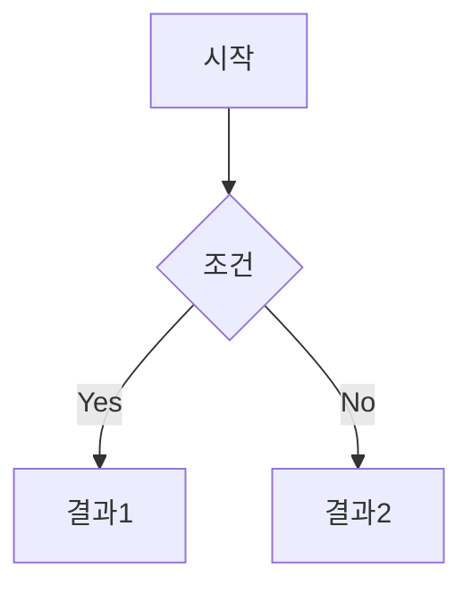

# Markdown 확장 구문 종합 정리

현재 널리 사용되는 Markdown 확장 구문을 플랫폼별로 정리했습니다.

---

## 1. Callouts / Admonitions (알림 박스)

| 플랫폼 | 구문 | 지원 타입 |
|--------|------|-----------|
| **GitHub** | `> [!NOTE]` | NOTE, TIP, IMPORTANT, WARNING, CAUTION |
| **Obsidian** | `> [!note]` | note, tip, info, warning, danger, bug, example, quote, abstract, todo, faq + 커스텀 |
| **Docusaurus** | `:::note` | note, tip, info, warning, danger |
| **Docsify** | `!>`, `?>` | Important, Tip |
| **GitLab** | `> **Note:**` | Note, Warning (자동 변환) |

```markdown
# GitHub/Obsidian
> [!CAUTION]
> 위험한 작업입니다.

# Docusaurus
:::warning[주의]
주의 사항입니다.
:::

# Docsify
!> 중요한 내용

?> 팁 내용
```

---

## 2. 텍스트 하이라이트

| 플랫폼 | 구문 | 결과 |
|--------|------|------|
| **Obsidian, GitLab, 일부 파서** | `==텍스트==` | 노란 배경 하이라이트 |
| **HTML 지원 파서** | `<mark>텍스트</mark>` | 하이라이트 |
| **GitLab** | `[- 삭제 -]`, `[+ 추가 +]` | 빨강/초록 diff 표시 |

```markdown
==하이라이트 텍스트==
<mark>HTML 하이라이트</mark>
```

---

## 3. Emoji 단축코드

| 플랫폼 | 지원 |
|--------|------|
| **GitHub, Slack, Discord** | `:emoji_name:` 형식 지원 |
| **Obsidian, Notion** | 지원 |

```markdown
:+1: :heart: :rocket: :warning:
```

---

## 4. Footnotes (각주)

```markdown
본문에 각주 참조[^1]를 추가합니다.

[^1]: 각주 내용입니다.
```

**지원**: GitHub, Obsidian, GitLab, Kramdown, PHP Markdown Extra

---

## 5. Math / LaTeX 수식

| 구문 | 용도 |
|------|------|
| `$E=mc^2$` | 인라인 수식 |
| `$$\sum_{i=1}^n x_i$$` | 블록 수식 |

**지원**: GitHub, Obsidian, GitLab, Kramdown, Jupyter

---

## 6. Definition Lists (정의 목록)

```markdown
용어
: 용어에 대한 정의

API
: Application Programming Interface
```

**지원**: Kramdown, PHP Markdown Extra, Pandoc (GFM 미지원)

---

## 7. Abbreviations (약어)

```markdown
HTML 문서를 작성합니다.

*[HTML]: Hyper Text Markup Language
```

**지원**: Kramdown, PHP Markdown Extra (GFM 미지원)

---

## 8. Diagrams (Mermaid)

````markdown

````

**지원**: GitHub, GitLab, Obsidian, Docusaurus, Notion

---

## 9. Task Lists (체크박스)

```markdown
- [x] 완료된 작업
- [ ] 미완료 작업
- [ ] 다른 작업
```

**지원**: 거의 모든 플랫폼 (GFM 표준)

---

## 10. Frontmatter (메타데이터)

```yaml
---
title: 문서 제목
author: 작성자
date: 2026-01-22
tags: [markdown, syntax]
---
```

**지원**: Jekyll, Hugo, Obsidian, Docusaurus, 대부분의 SSG

---

## 11. Table 확장

| 기본 | 확장 |
|------|------|
| 정렬 `:---`, `:---:`, `---:` | GFM 표준 |
| 셀 병합 | HTML 필요 또는 Pandoc |
| 캡션 | 일부 파서 지원 |

---

## md2html_v2 지원 우선순위 제안

| 우선순위 | 기능 | 현재 상태 |
|----------|------|-----------|
| 🔴 **P0** | Callouts (GitHub, Docusaurus, Docsify) | 일부 지원 → 확장 필요 |
| 🟠 **P1** | Highlight (`==text==`) | 미지원 |
| 🟠 **P1** | Emoji (`:emoji:`) | 미지원 |
| 🟢 **P2** | Footnotes | Goldmark 확장으로 가능 |
| 🟢 **P2** | Definition Lists | Goldmark 확장으로 가능 |
| 🔵 **P3** | Math/LaTeX | MathJax/KaTeX 통합 필요 |
| ✅ | Mermaid | **지원됨** |
| ✅ | Tables | **지원됨** (GFM) |
| ✅ | Task Lists | **지원됨** (GFM) |
